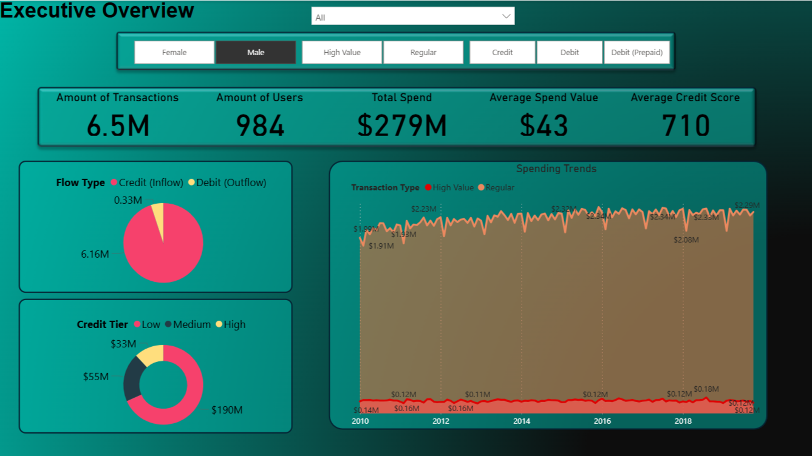
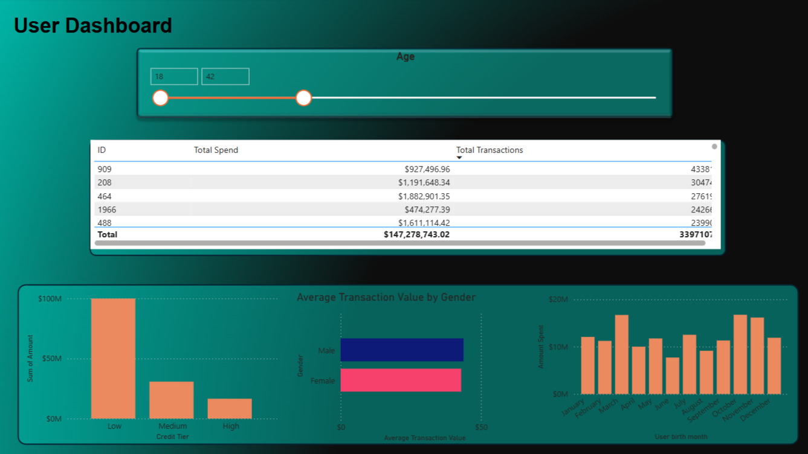
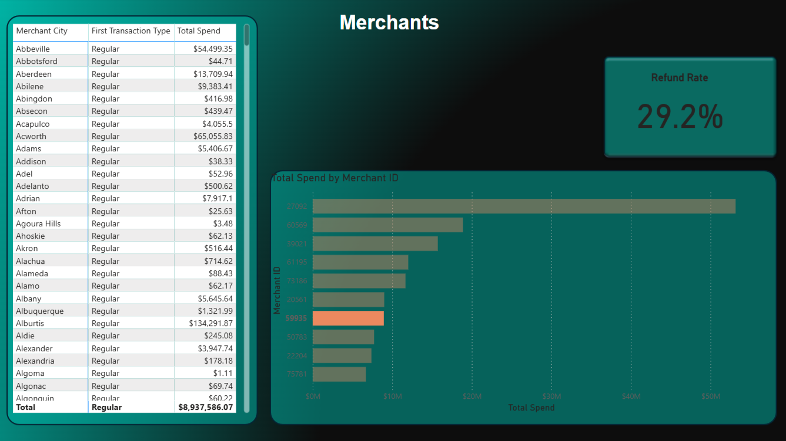
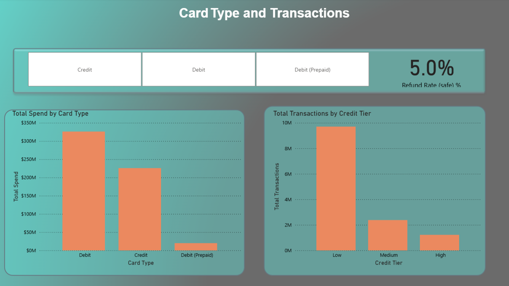
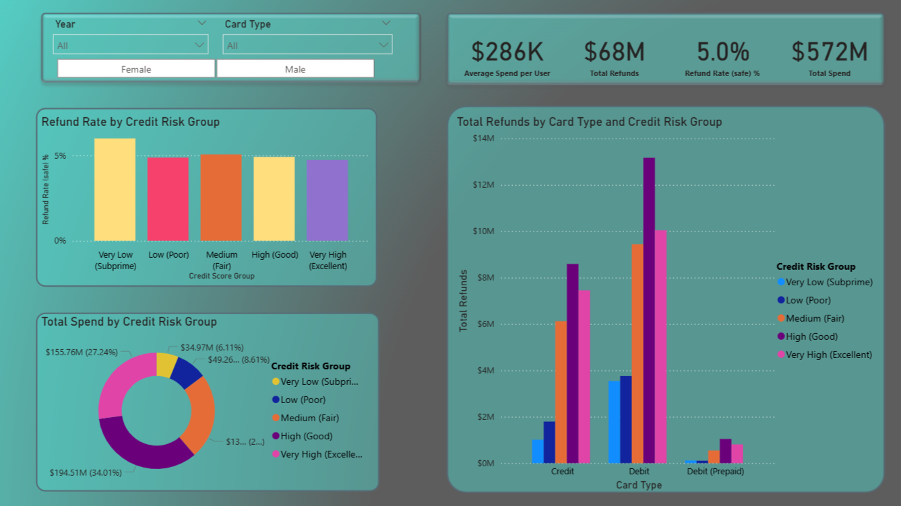

# Banking Customer and Credit Risk Analysis (Power BI)

## Overview
This Power BI project explores customer spending behavior, merchant activity, and credit risk patterns using a synthetic banking dataset.  
It includes five dashboards designed to provide a layered view of customer and business insights.

### Dashboards Included
1. **Executive Overview** – overall business performance  
2. **User Dashboard** – customer demographics and spending  
3. **Merchants Dashboard** – merchant activity and refund performance  
4. **Card Type and Transactions** – analysis of debit, credit, and prepaid card performance  
5. **Credit Risk View** – relationship between credit score, spending, and refunds  

---

## Executive Overview

This page provides high-level metrics such as total transactions, total spend, and average credit score.  
It highlights that:
- Most spending comes from **regular transactions** rather than high-value ones.  
- Debit outflows dominate over credit inflows.  
- The majority of customers fall into the **low or medium credit tier** group.

---

## User Dashboard

Key insights:
- Younger users (ages 18–42) account for a major share of spending.  
- **Low credit-tier** users spend significantly more overall.  
- Males and females have similar average spend values, suggesting spending behavior is not gender-biased.  
- Birth months show relatively consistent spending patterns throughout the year.

---

## Merchants Dashboard

This page ranks merchants by **total spend** and visualizes refund rates by merchant.  
Key observations:
- A small group of merchants generates a large portion of the total transaction value.  
- Refund rates are consistent (around 5 %), but a few top merchants account for a higher refund volume.

---

## Card Type and Transactions

Insights:
- **Debit cards** contribute the largest total spend and transaction count.  
- **Credit cards** show slightly lower overall spending but stable usage.  
- **Prepaid cards** have minimal activity, likely used for smaller or limited transactions.

---

## Credit Risk View

This dashboard connects spending and refund rates with customer credit score segments.  
Findings:
- Customers with **very low (subprime)** credit scores have the **highest refund rate**, around 6 %.  
- Spending volume increases steadily with higher credit tiers.  
- Debit cards show the highest refund values across all risk groups.

---

## Key Metrics Summary
| Metric | Value |
|--------|-------|
| **Total Spend** | $572 M |
| **Total Refunds** | $68 M |
| **Average Spend per User** | $286 K |
| **Refund Rate (safe)** | 5 % |
| **Highest Spending Group** | Very High Credit Score |
| **Highest Refund Rate** | Very Low Credit Score (Subprime) |

---

## Technical Details
- Built and modeled in **Power BI Desktop**
- Data cleaning and transformation in **Power Query**
- Key calculated columns:
  - `Flow Type` (Credit / Debit)
  - `Month Name` and `Year`
  - `Credit Risk Group` (based on Credit Score)
- Measures created:
  - `Total Spend`
  - `Total Refunds`
  - `Average Spend per User`
  - `Refund Rate (%)`

---

## Files in Repository
- `Exec_OverView.png` – Executive Overview  
- `User_Dash.png` – User Dashboard  
- `Merchants.png` – Merchants Dashboard  
- `Card_Type.png` – Card Type and Transactions  
- `Credit_Risk.png` – Credit Risk Dashboard  
- `README.md` – this documentation  

---

## About
This project demonstrates how Power BI can be used to translate transactional banking data into clear insights about customer behavior, merchant performance, and credit risk patterns.  
It can serve as a foundation for more advanced analytics such as churn prediction or credit scoring models.
